# Emulate Linux Kernel Version 0.01

Using a Emulator, I want to mimic the machine that Linus Torvolds used to develop the 1st version of the Linux Kernel.  

See steps below, it discusses CPU, Disk, and Filesystem required to be able to boot up a Linux instance in the Emulator using version 0.01 of the Linux Kernel.   

## The Goal or End Result

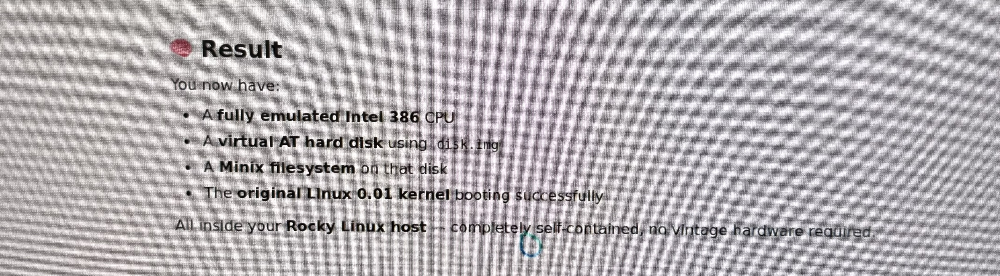

## Steps

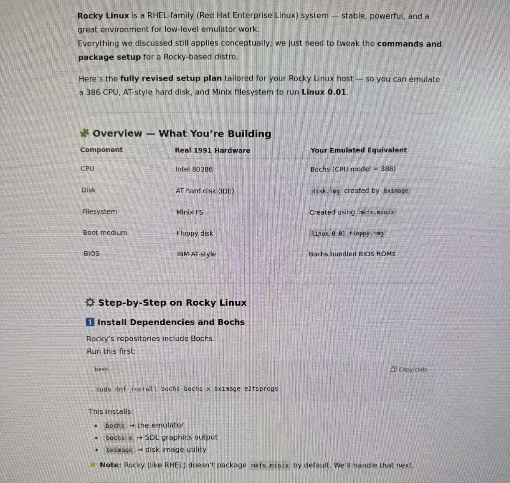
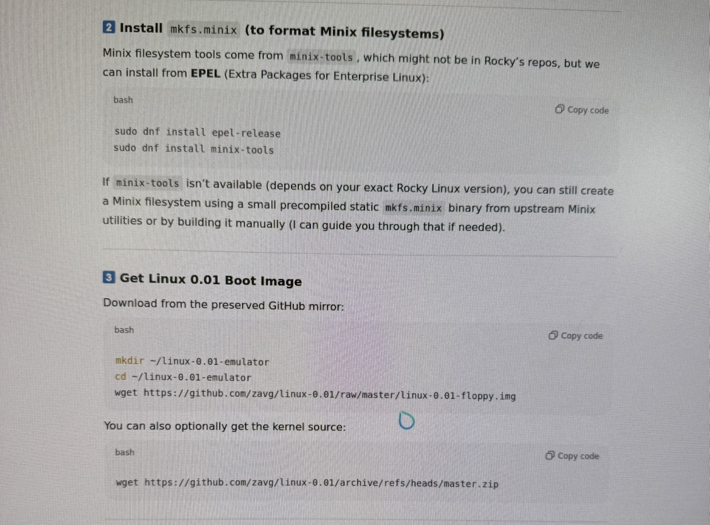
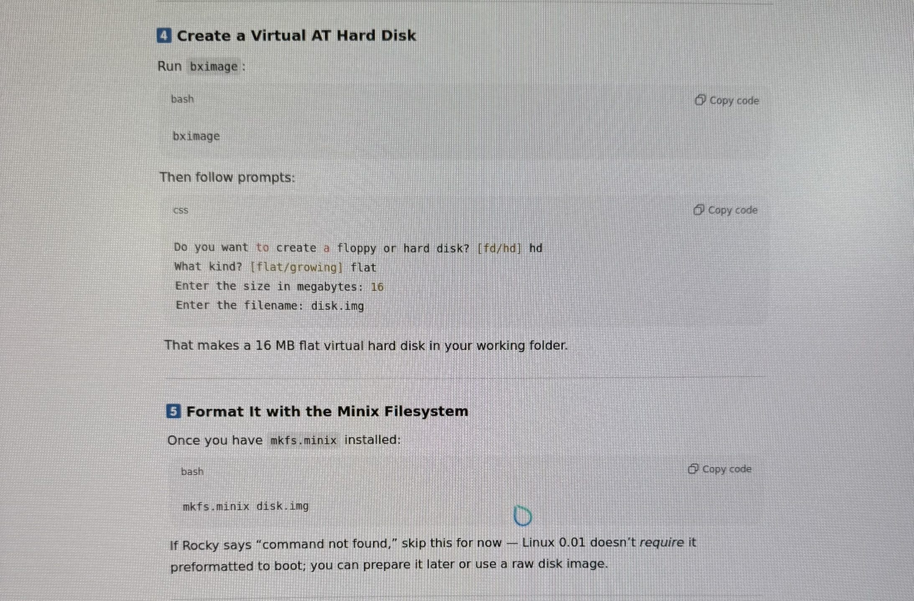
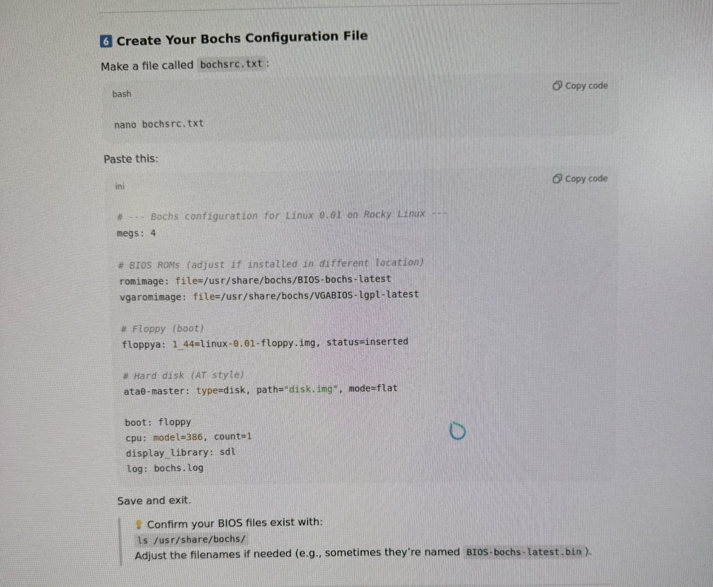
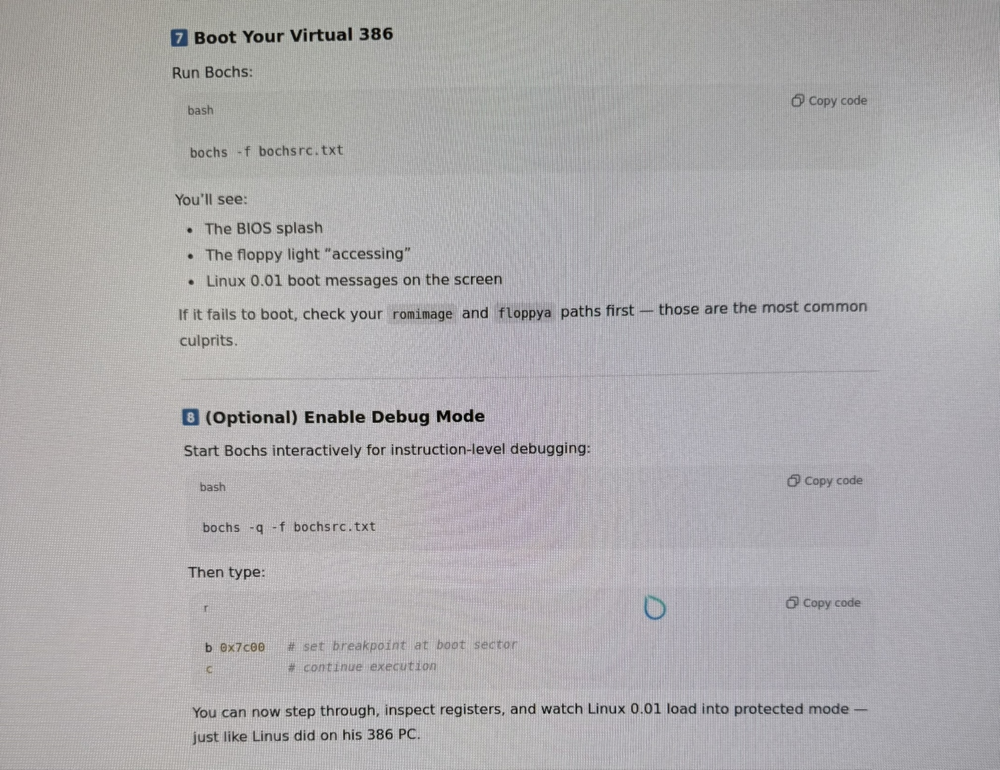
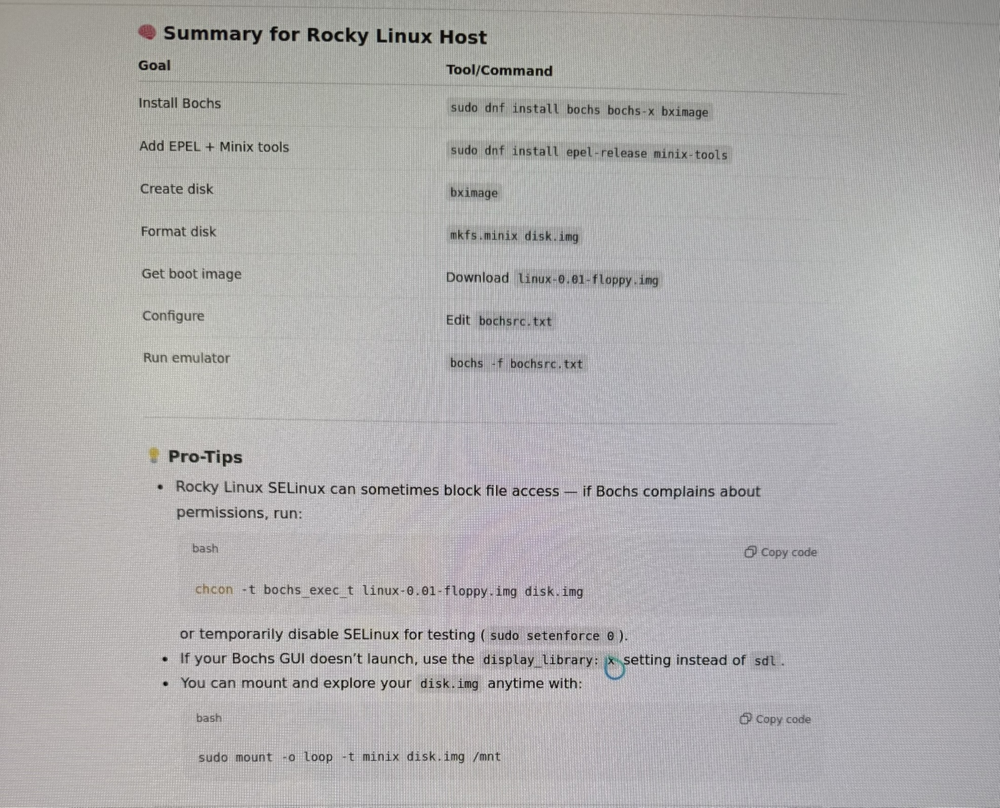
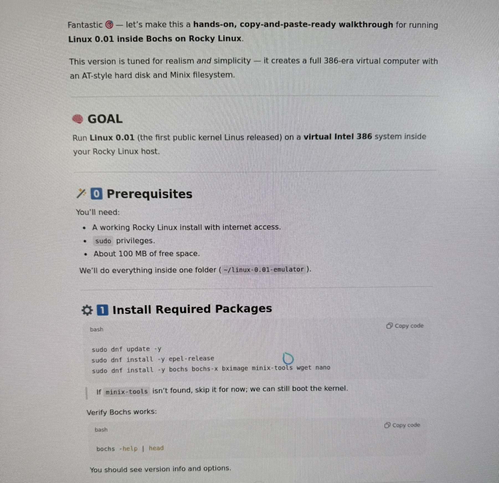
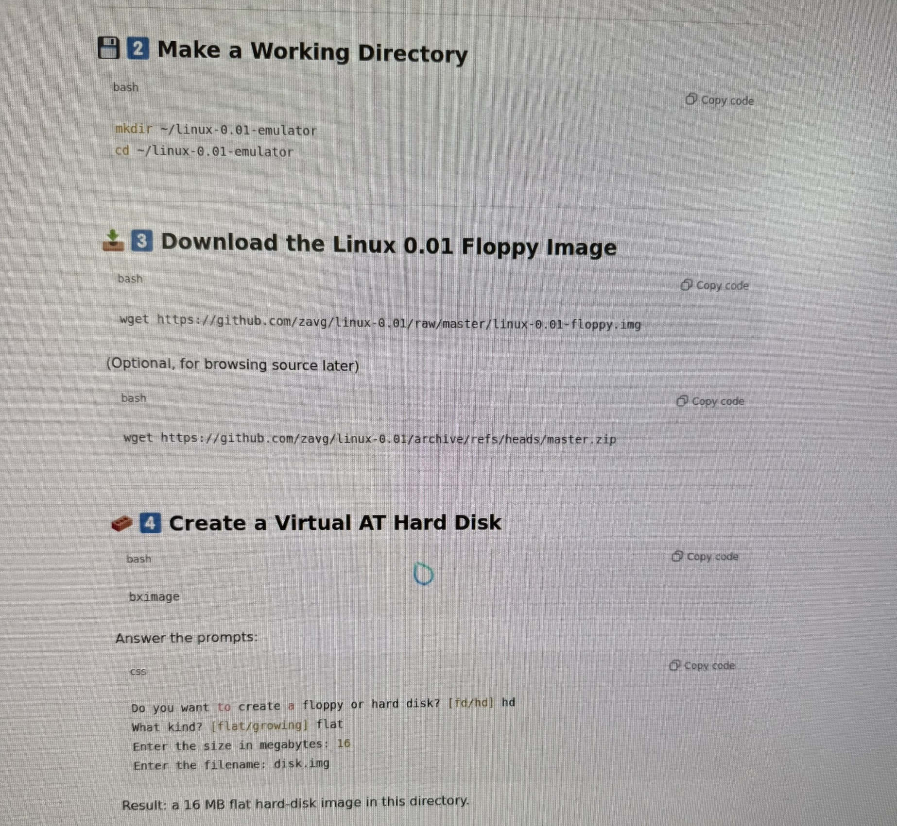
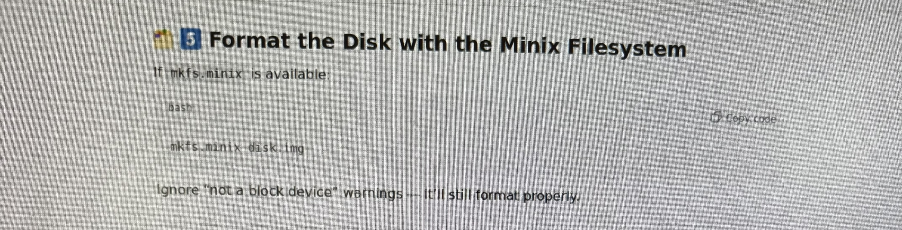
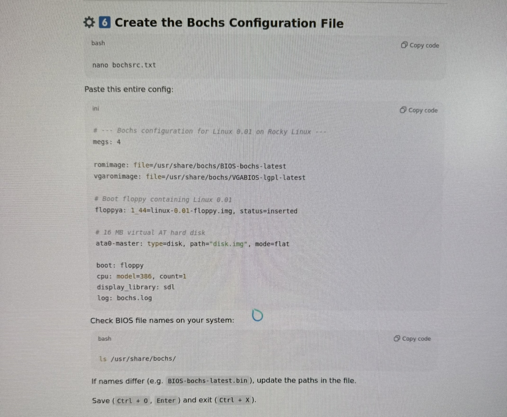
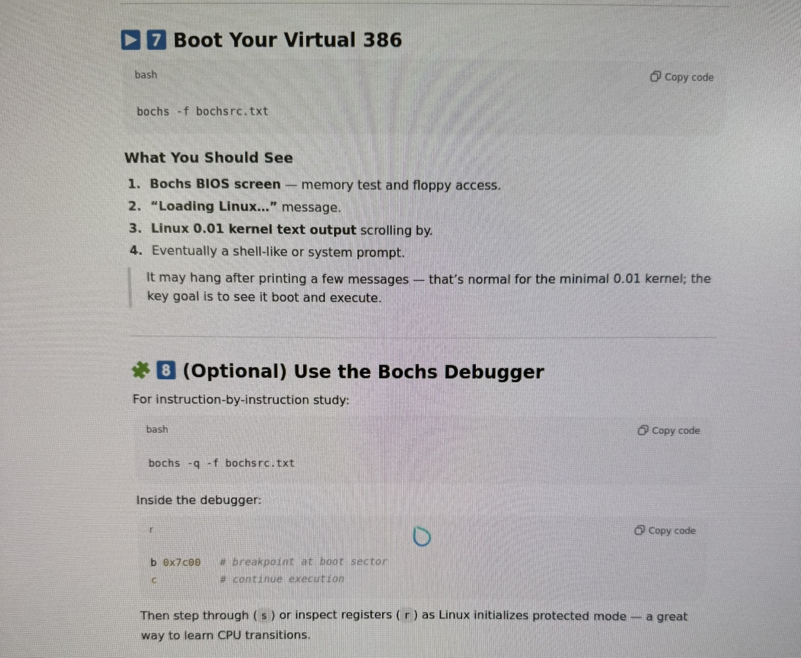
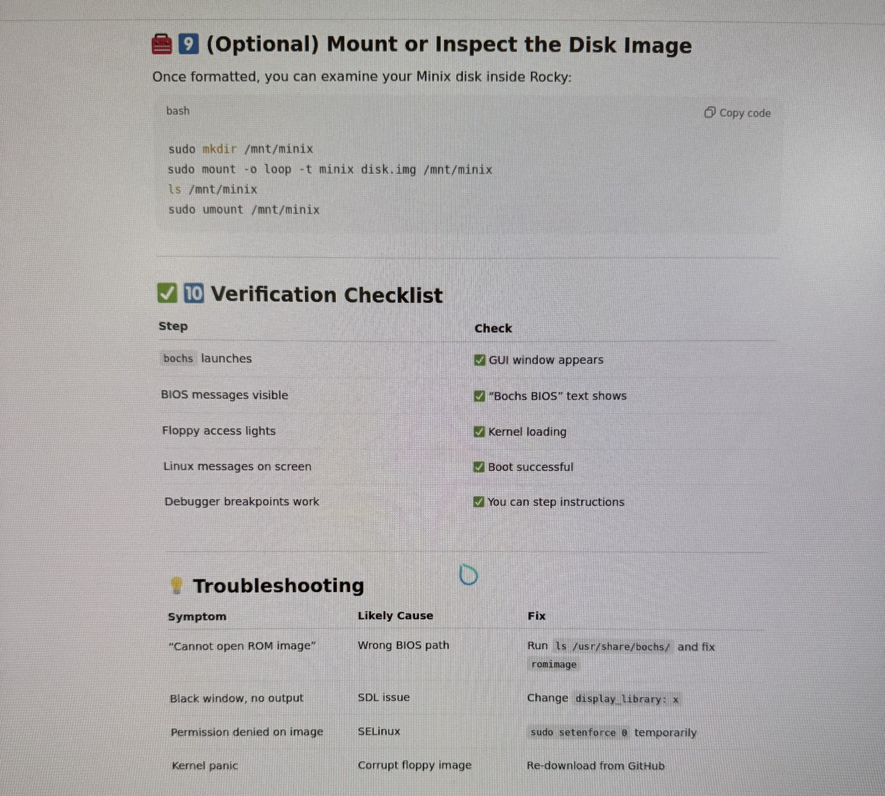

